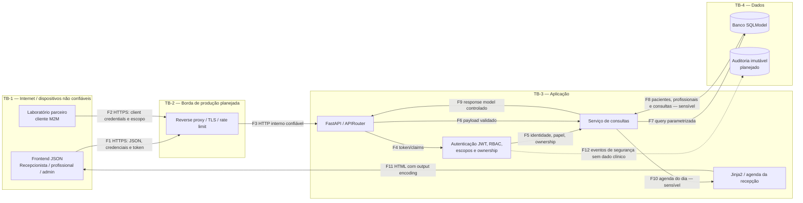

# Exercício 3 — Diagrama de fluxo de dados

## Legenda

- **E**: entidade externa.
- **P**: processo.
- **D**: armazenamento.
- **TB**: trust boundary.
- **Sensível**: contém identidade, vínculo assistencial ou dado clínico.
- Linhas tracejadas representam componentes planejados, ainda não implementados.

## Inventário dos fluxos

| Fluxo | Dados | Classificação | Controle implementado | Controle ainda necessário |
|---|---|---|---|---|
| F1 | Payloads de consulta, credenciais e tokens | Muito alta | Pydantic, JWT, CORS e limites; HTTPS exigido no deploy | TLS comprovado na borda |
| F2 | Credencial M2M e pedido de disponibilidade | Segredo/operacional | Client Credentials, escopo e token de serviço | Rotação operacional do segredo |
| F3 | Requisição encaminhada | Sensível | Headers de segurança e negação por padrão | TLS externo e rede privada comprovados |
| F4/F5 | JWT, claims, papel e ownership | Muito alta | Assinatura, expiração, audience e autorização central | Revogação e IdP de produção |
| F6 | IDs, horário e observação | Dado de saúde | Schema fechado e timezone | Whitelist de texto e regras de negócio |
| F7/F8 | Dados persistidos | Muito alta | SQLModel parametrizado e sessão injetada | Banco produtivo, least privilege e criptografia |
| F9 | Resposta JSON | Dado de saúde mínimo | `response_model` e autorização por objeto | Revisão contínua do contrato |
| F10/F11 | Agenda nominal e observação | Muito alta | JWT, papel, filtro diário, autoescape e CSP | Isolamento adicional por clínica |
| F12 | Quem fez o quê e quando | Interno restrito | Não implementado | Integridade, retenção e acesso restrito |

## Trust boundaries

### TB-1 — Cliente para borda

Todo campo, header, cookie, parâmetro, token e identificador é não confiável. A existência de um
UUID não comprova autorização. A fronteira deve garantir TLS, limites, validação e identidade.

### TB-2 — Borda para aplicação

O proxy pode aplicar controles de transporte, mas não decide regras de ownership. Headers de
identidade enviados pelo cliente não podem ser aceitos como verdade; somente claims de tokens
validados pela aplicação serão usados.

### TB-3 — Aplicação para dados

O processo da API não deve obter privilégios administrativos do banco. A sessão é criada por
requisição (`app/database/session.py:8`) e as consultas atuais usam APIs parametrizadas
(`app/services/appointments.py:36`). O arquivo SQLite local é apenas uma configuração de
desenvolvimento.

### TB-4 — Aplicação para HTML/browser

Dados persistidos continuam não confiáveis quando retornam do banco. O autoescape configurado em
`app/routes/reception.py:24` deve permanecer ativo e nenhum template deve aplicar `safe` sobre
conteúdo de usuário.

## Dados sensíveis em repouso e em trânsito

- Em trânsito: IDs, nomes, horários, observações, tokens e registro profissional.
- Em repouso: tabelas `patients`, `professionals`, `appointments`, `users` e `oauth_clients`;
  futuramente, auditoria.
- Não devem aparecer em logs: senhas, tokens completos, documento do paciente ou texto clínico.
- O laboratório deve receber somente janelas de disponibilidade sem identidade ou motivo da
  consulta.
