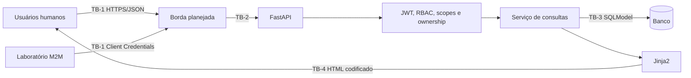

# Threat model consolidado — API de Agendamento

## 1. Overview

A aplicação oferece CRUD JSON de consultas, agenda HTML autenticada e disponibilidade M2M. O
processo FastAPI valida dados por schemas Pydantic, autentica JWT, combina RBAC com ownership,
chama uma camada de serviço e persiste por SQLModel. A versão atual usa SQLite local e continua
adequada somente a desenvolvimento; a borda e o banco de produção ainda não existem.

### Componentes e evidências

| Componente | Função | Evidência |
|---|---|---|
| FastAPI | Inicialização, routers e middlewares | `app/main.py:22` |
| Router de consultas | CRUD e contratos de resposta | `app/routes/appointments.py:20` |
| Schemas | Entrada fechada, notas validadas e saída mínima | `app/schemas/appointment.py:18`, `app/schemas/appointment.py:59` |
| Serviço de domínio | Verificação de referências e persistência | `app/services/appointments.py:11` |
| Página da recepção | Agenda diária renderizada | `app/routes/reception.py:27` |
| Jinja2 | Output encoding HTML | `app/routes/reception.py:24` |
| SQLModel | Modelos e queries parametrizadas | `app/models/appointment.py:15`, `app/services/appointments.py:36` |
| Configuração | Banco, JWT, CORS e rate limiting por ambiente | `app/config.py:7` |
| Autenticação | OAuth2, tokens humanos e Client Credentials | `app/routes/auth.py:28`, `app/routes/auth.py:72` |
| Autorização | Papéis, MFA e ownership | `app/security/authorization.py:27`, `app/security/authorization.py:54` |
| JWT | Expiração, issuer, audience, algoritmo fixo e claims | `app/security/jwt.py:18`, `app/security/jwt.py:43` |
| M2M | Disponibilidade mínima sob escopo dedicado | `app/routes/availability.py:16` |
| Hardening HTTP | Rate limiting, JWT inicial e headers | `app/security/middleware.py:39`, `app/security/middleware.py:83`, `app/security/middleware.py:99` |

### Recursos efetivos

| Deployment ou workflow | Recurso ou capacidade | Configuração e precedência | Valor/local seguro efetivo | Leitores/escritores/destinatários | Controle | Evidência ou desconhecido |
|---|---|---|---|---|---|---|
| Desenvolvimento local | Banco de consultas | Ambiente e depois `.env`; default no código | `./data/appointments.db` | Processo local da API | Permissões do host e SQLModel | `app/config.py:11`; criptografia não comprovada |
| Testes | Banco efêmero em memória | Fixture sobrescreve dependência | `sqlite://` em memória | Processo pytest | `StaticPool` e fixture isolada | `tests/conftest.py:24` |
| API JSON | Serialização pública | `response_model` da rota | `AppointmentRead` | Cliente HTTP autorizado | Allowlist de campos | `app/routes/appointments.py:32` |
| Agenda HTML | Conteúdo renderizado | Diretório de templates fixo | `app/templates/` | Navegador autenticado | Autoescape | `app/routes/reception.py:24` |
| Produção futura | Credencial de banco | Variável/secret manager deve substituir default | Desconhecido; não definido no repositório | API e operadores autorizados | Requisito de deploy | Manifesto de infraestrutura ausente |
| Desenvolvimento/teste | Chave JWT | Ambiente ou `.env`; sem default | Referência `JWT_SECRET_KEY`, mínimo 32 caracteres | Emissor/validador da API | Validação antes de assinar | `app/security/jwt.py:11` |
| Produção futura | Chave JWT | Secret manager deve fornecer o ambiente | Valor desconhecido e não registrado | Emissor/validador da API | Rotação e acesso mínimo planejados | Manifesto de deploy ausente |

## 2. Threat Model, Trust Boundaries, and Assumptions

### Ativos

- Identidade do paciente e do profissional.
- Horário, motivo, observação, status e vínculo assistencial.
- Integridade da agenda e disponibilidade de atendimento.
- Futuras senhas, tokens, chaves de assinatura e credenciais M2M.
- Trilhas de auditoria e capacidade de atribuir ações.
- Disponibilidade agregada entregue ao parceiro sem informação clínica.

### Atores e capacidades iniciais

| Ator | Controla inicialmente | Não deve possuir inicialmente | Ganho relevante em caso de falha |
|---|---|---|---|
| Cliente anônimo | Requisição HTTP, headers, payload e IDs | Identidade válida ou acesso clínico | Ler/alterar consultas ou causar indisponibilidade |
| Recepcionista | JWT e funções operacionais | Administração ou prontuário completo | Acesso além da clínica/agenda necessária |
| Profissional | JWT e consultas próprias | Consultas de outros profissionais | Ler ou alterar paciente alheio |
| Administrador | JWT com MFA simulado | Acesso irrestrito sem rastreio | Suprimir auditoria ou extrair base |
| Laboratório | Credencial M2M e disponibilidade | Identidade de paciente e CRUD | Transformar token restrito em acesso humano |
| Processo no host | Acesso concedido pelo sistema operacional | Segredos não atribuídos e banco completo | Extrair ou adulterar dados em repouso |

### Trust boundaries e invariantes

- **TB-1, cliente→borda:** toda entrada é hostil; TLS, limite e identidade são obrigatórios.
- **TB-2, borda→API:** headers fornecidos pelo cliente não provam identidade; a API valida o token.
- **TB-3, API→banco:** queries são parametrizadas e a conta deve ter privilégio mínimo.
- **TB-4, banco→browser:** dado persistido continua não confiável e sempre recebe output encoding.
- Uma identidade válida não implica acesso a todo objeto: ownership é verificado a cada operação.
- Um token M2M nunca é promovido a usuário humano e não alcança dados clínicos.
- Campos internos permanecem fora de responses, logs e documentação pública.

### Controles estabelecidos

- Contrato mínimo de saída (`app/schemas/appointment.py:59`).
- Propriedades extras proibidas (`app/schemas/appointment.py:24`,
  `app/schemas/appointment.py:44`).
- Tipos UUID, status fechado e tamanho de notas (`app/models/appointment.py:18`).
- SQLModel/SQLAlchemy sem montagem de SQL (`app/services/appointments.py:36`).
- Autoescape Jinja2 (`app/routes/reception.py:24`).
- Limite de paginação (`app/routes/appointments.py:43`).
- Testes de não exposição e XSS (`tests/test_appointments.py:33`,
  `tests/test_templates.py:28`).
- Bcrypt, JWT expirável e claims obrigatórias (`app/security/passwords.py:4`,
  `app/security/jwt.py:28`).
- RBAC combinado com ownership (`app/security/authorization.py:9`,
  `app/security/authorization.py:54`).
- Separação entre token humano e token M2M (`app/security/authentication.py:69`).
- Revogação efetiva e confronto das claims com o estado atual
  (`app/security/authentication.py:46`).
- Rate limiting diferenciado para autenticação humana e M2M
  (`app/security/middleware.py:55`).
- CORS explícito e headers de proteção do browser (`app/main.py:38`,
  `app/security/middleware.py:99`).
- Allowlist de caracteres em notas de criação e atualização
  (`app/schemas/appointment.py:9`).

### Premissas e questões abertas

- Produção terá proxy TLS, rede privada e banco relacional gerenciado; ainda não há evidência de
  configuração.
- TOTP/WebAuthn e rotação automática de chaves ainda não existem; a revogação imediata baseada em
  `is_active` já é aplicada a usuários e clientes.
- A unidade de isolamento por clínica e a política de retenção LGPD precisam de decisão do produto.
- RPO, RTO, localidade de backup e responsável pela rotação de chaves ainda não foram definidos.
- Não foi feita revisão arquitetural independente porque delegação por subagente não foi
  autorizada nesta execução; foi realizado um segundo passe sequencial sobre entry points,
  consumidores sensíveis e valores efetivos.

## 3. Attack Surface, Mitigations, and Attacker Stories

Todas as linhas são **hipóteses de ameaça**, não findings validados. A etapa de auditoria fará a
validação formal.

| Prioridade | Cenário e ganho de capacidade | Pré-requisitos | Impacto | Controle atual | Mitigação | Evidência |
|---|---|---|---|---|---|---|
| Alta, regressão | TM-01: trocar UUID e acessar objeto alheio | Falha ou omissão do controle em nova rota | Vazamento/alteração de saúde | Ownership central + teste cruzado | Expandir matriz de testes | `app/security/authorization.py:54` |
| Alta, regressão | TM-02: cliente anônimo executa CRUD | Rota futura sem dependência | Compromisso da agenda | OAuth2/JWT e scopes nas rotas atuais | Auditoria automatizada do OpenAPI | `app/routes/appointments.py:22` |
| Média, residual | TM-03: abrir agenda nominal sem papel adequado | Token humano válido | Divulgação além da necessidade | JWT, RBAC e filtro profissional | Isolamento por clínica | `app/routes/reception.py:27` |
| Alta, regressão | TM-04: token do laboratório acessa endpoints humanos | Confusão entre tipos de token | Dados clínicos via credencial M2M | `token_type`, scope e endpoint dedicado | Testar todas as rotas humanas | `app/security/authentication.py:69` |
| Alta, residual | TM-05: brute force ou flood distribuído | Login/serviço exposto e múltiplas origens/réplicas | Conta tomada ou indisponibilidade | Bcrypt, MFA e rate limit local diferenciado | Limitador distribuído e alerta | `app/security/middleware.py:39` |
| Alta | TM-06: adulteração sem atribuição | Acesso a PATCH/DELETE | Agenda corrompida e repúdio | Timestamp interno | Principal + auditoria append-only | `created_by` default em `app/models/appointment.py:27` |
| Alta | TM-07: copiar/adulterar arquivo de banco | Acesso ao host | Base completa comprometida | Permissão do host | Banco isolado, criptografia e least privilege | Default local em `app/config.py:11` |
| Média, regressão | TM-08: stored XSS captura sessão futura | Bypass da validação e sink sem encoding | Ação no navegador da recepção | Allowlist, autoescape e CSP | Proibir `safe` e manter testes | `app/schemas/appointment.py:9`, `tests/test_templates.py:21` |
| Média | TM-09: mass assignment forja auditoria | Enviar campo extra | Integridade de metadados | `extra="forbid"` testado | Política em todos os schemas e OpenAPI | `tests/test_appointments.py:90` |
| Média | TM-10: datas conflitantes quebram agenda | Criar horários simultâneos | Dupla marcação | Timezone obrigatório | UTC, constraint e transação | `app/schemas/appointment.py:26` |

### Superfícies condicionais privilegiadas

- Pipeline e deploy: ainda não implementados; futuramente tokens de CI devem ter permissões
  mínimas e jobs de pull request não acessam segredos de produção.
- Administração: MFA é requisito, mas não transforma operações administrativas em não auditáveis.
- Backup/restauração: restauração é operação privilegiada e deve validar destino, versão e
  autorização antes de substituir dados.

## 4. Severity Calibration

### Critical

Compromisso sistêmico ou em massa de dados de saúde, bypass total de autenticação/autorização ou
capacidade remota de administrar a aplicação. TM-01/TM-02 deixam de ser falhas abertas na etapa 3,
mas uma regressão sistêmica nesses controles voltaria a bloquear produção. Um cenário que exige
controle administrativo legítimo prévio não é crítico sem demonstrar ganho adicional.

### High

Leitura ou alteração de dados de outro titular, tomada de conta privilegiada, vazamento relevante
de segredos ou indisponibilidade prolongada do atendimento. Um token M2M que alcança dados
clínicos é alto ou crítico conforme escala e alcance.

### Medium

Exploração requer pré-condição significativa, afeta conjunto limitado ou encontra controle
efetivo que reduz a probabilidade, mas ainda causa impacto relevante. Stored XSS está classificado
como hipótese média nesta versão porque o autoescape é comprovado; volta a alto se surgir um sink
sem encoding ou uma sessão privilegiada explorável.

### Low

Divulgação operacional sem dado pessoal, endurecimento ausente sem caminho explorável ou efeito
autolimitado. Ausência isolada de header informativo pode ser baixa; ela sobe quando compõe um
caminho real, como clickjacking sobre ação sensível.

Severidade mede impacto e alcance; confiança mede a força da evidência. Uma hipótese de alto
impacto pode ter baixa confiança e continuar exigindo validação, sem ser apresentada como finding.

## 5. Atualização da etapa 4

A auditoria estática pré-correção registrou três findings de alta confiança: tentativas ilimitadas
nos emissores de token (alta), tokens de identidades desativadas válidos até a expiração (média) e
headers de proteção ausentes (baixa). Todos foram tratados na versão atual. BOLA, mass assignment,
SQL injection e stored XSS foram reavaliados com testes negativos; não permanecem como findings
abertos nesta entrega. O relatório e os artefatos canônicos foram preservados em
`docs/evidencias/security_scan_before/`.

Risco residual principal: o limitador em memória não agrega múltiplas réplicas e não substitui
gateway/WAF; HSTS depende de TLS efetivo na borda; auditoria append-only e controles de produção
continuam pendentes. A aplicação permanece classificada para desenvolvimento local.

## 6. Atualização da etapa 5

O threat model agora alimenta diretamente a suíte de segurança e o pipeline. TM-01, TM-02,
TM-04, TM-05, TM-08, TM-09 e TM-10 possuem testes negativos rastreados em
`docs/estrategia_testes_seguranca.md`. O GitHub Actions executa testes, SAST, análise de
dependências e DAST passivo, e o job agregador bloqueia o merge quando um controle obrigatório
falha. Os limiares técnicos e os elevadores de impacto de negócio estão documentados em
`docs/cvss_priorizacao.md`.

Repository: local:nathalia_artigas_DR2_AT
Version: sha256:367744b5c8476fdf2941aa2967a455c4efb0b3e625f60ff60a59a5252698338e
